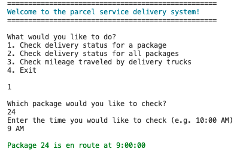

# Package Delivery System 🚚📦  

This project implements a **package delivery routing system** that simulates a local delivery service. It reads package and distance data, stores them in a **custom-built hash table**, and calculates the most efficient delivery routes using a greedy algorithm. 

## 📸 Screenshot

### Program Running in Terminal


## Features 

- **Nearest Neighbor Routing Algorithm**  
  Uses a greedy nearest-neighbor algorithm to decide the next delivery stop, reducing overall mileage.

- **Dynamic Adaptation**  
  Routes adapt when package data changes (e.g., address corrections mid-route).  

- **Truck Loading Rules**  
  Packages are distributed across trucks based on:
  - Deadlines  
  - Grouping requirements  
  - Truck capacity  
  - Driver/truck availability  

- **Scalability**  
  Can adapt to changes in input data and recompute delivery order dynamically.

## ⚙️ Data Structures

- **Custom Hash Table**  
  Implemented from scratch (no imports). Stores all package data for **O(1)** average lookup time.  

---

## 🚀 How to Run

1. **Clone the repository**
   ```bash
   git clone https://github.com/CourtneyKimbrough/routing-program.git
   cd routing-program
2. **Make sure you have Python 3 installed** 
    You can check with:
    ```bash
    python3 --version
3. **Run the main program**
    ```bash
    python3 main.py
